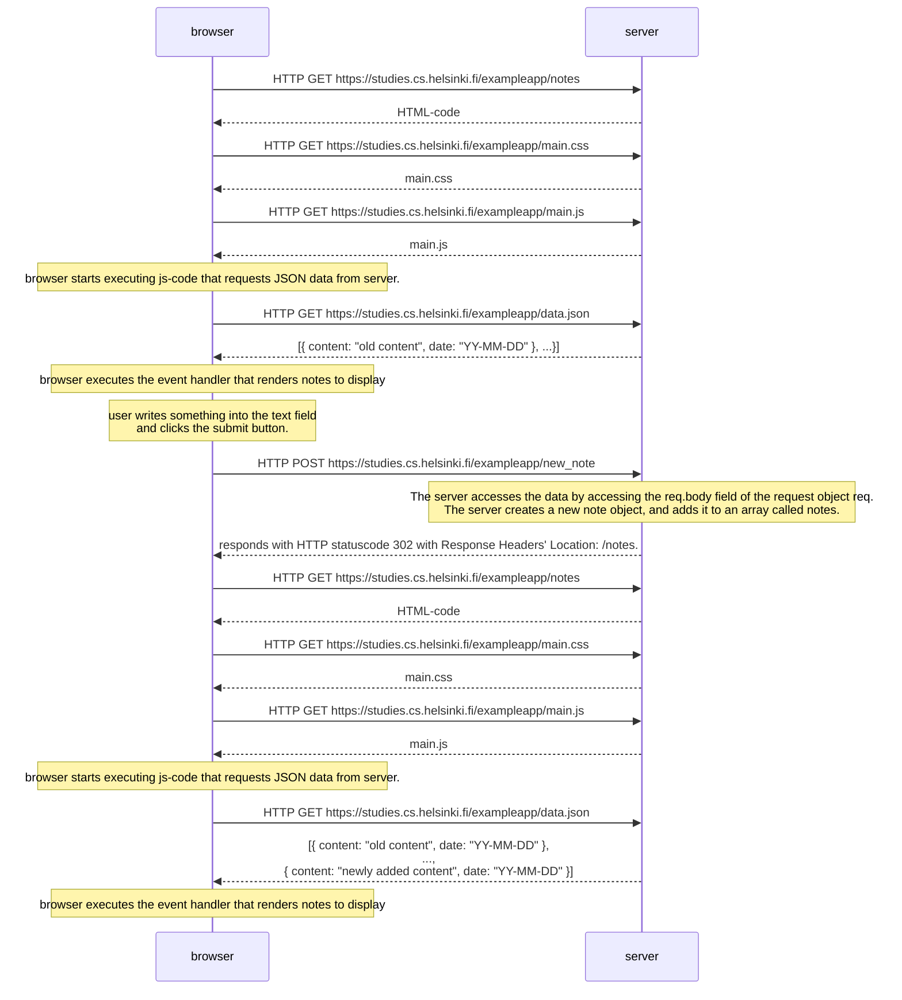

```mermaid
sequenceDiagram
browser->>server: HTTP GET https://studies.cs.helsinki.fi/exampleapp/notes
server-->>browser: HTML-code
browser->>server: HTTP GET https://studies.cs.helsinki.fi/exampleapp/main.css
server-->>browser: main.css
browser->>server: HTTP GET https://studies.cs.helsinki.fi/exampleapp/main.js
server-->>browser: main.js

note over browser: browser starts executing js-code that requests JSON data from server.

browser->>server: HTTP GET https://studies.cs.helsinki.fi/exampleapp/data.json
server-->>browser: [{ content: "old content", date: "YY-MM-DD" }, ...}]

note over browser: browser executes the event handler that renders notes to display

note over browser: user writes something into the text field <br>and clicks the submit button.

browser->>server: HTTP POST https://studies.cs.helsinki.fi/exampleapp/new_note

note over server: The server accesses the data by accessing the req.body field of the request object req.<br>The server creates a new note object, and adds it to an array called notes.

server-->>browser: responds with HTTP statuscode 302 with Response Headers' Location: /notes.

browser->>server: HTTP GET https://studies.cs.helsinki.fi/exampleapp/notes
server-->>browser: HTML-code
browser->>server: HTTP GET https://studies.cs.helsinki.fi/exampleapp/main.css
server-->>browser: main.css
browser->>server: HTTP GET https://studies.cs.helsinki.fi/exampleapp/main.js
server-->>browser: main.js

note over browser: browser starts executing js-code that requests JSON data from server.

browser->>server: HTTP GET https://studies.cs.helsinki.fi/exampleapp/data.json
server-->>browser: [{ content: "old content", date: "YY-MM-DD" },<br> ...,<br> { content: "newly added content", date: "YY-MM-DD" }]

note over browser: browser executes the event handler that renders notes to display
```
