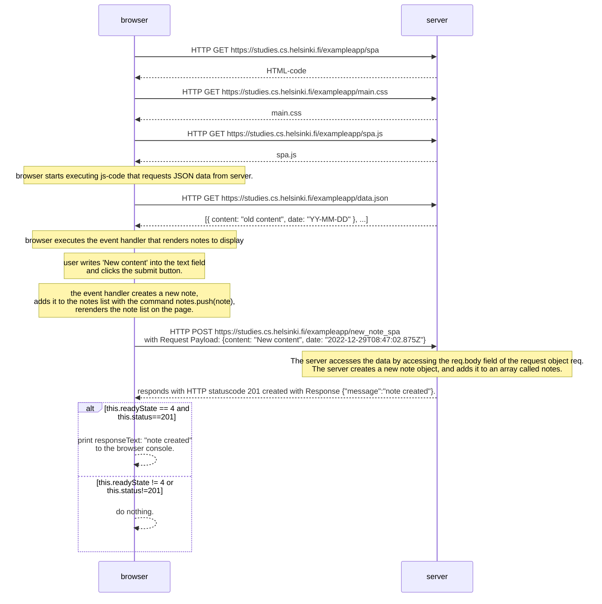

```mermaid
sequenceDiagram
browser->>server: HTTP GET https://studies.cs.helsinki.fi/exampleapp/spa
server-->>browser: HTML-code
browser->>server: HTTP GET https://studies.cs.helsinki.fi/exampleapp/main.css
server-->>browser: main.css
browser->>server: HTTP GET https://studies.cs.helsinki.fi/exampleapp/spa.js
server-->>browser: spa.js

note over browser: browser starts executing js-code that requests JSON data from server.

browser->>server: HTTP GET https://studies.cs.helsinki.fi/exampleapp/data.json
server-->>browser: [{ content: "old content", date: "YY-MM-DD" }, ...]

note over browser: browser executes the event handler that renders notes to display

note over browser: user writes 'New content' into the text field <br>and clicks the submit button.

note over browser: the event handler creates a new note, <br>adds it to the notes list with the command notes.push(note),<br>rerenders the note list on the page.

browser->>server: HTTP POST https://studies.cs.helsinki.fi/exampleapp/new_note_spa<br>with Request Payload: {content: "New content", date: "2022-12-29T08:47:02.875Z"} 

note over server: The server accesses the data by accessing the req.body field of the request object req.<br>The server creates a new note object, and adds it to an array called notes.

server-->>browser: responds with HTTP statuscode 201 created with Response {"message":"note created"}.

alt  this.readyState == 4 and this.status==201
    browser-->>browser: print responseText: "note created" <br>to the browser console.
else this.readyState != 4 or this.status!=201
    browser-->>browser: do nothing.
end
```